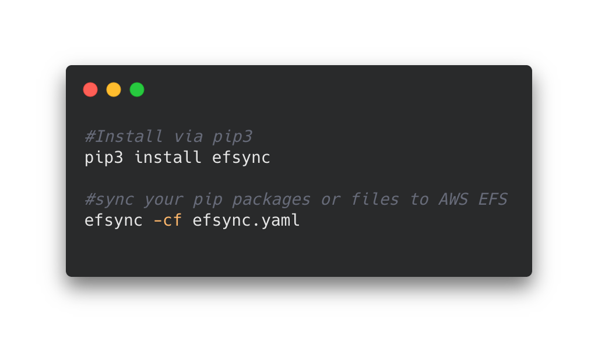

# 🚀 efsync - Open-Source MLOps tool for running serverless machine learning

[](https://pepy.tech/project/efsync) [](https://colab.research.google.com/github/philschmid/efsync/blob/main/examples/efsync_pip_packages_and_s3_files.ipynb)  [](https://badge.fury.io/py/efsync)

efsync is an CLI/SDK tool, which automatically syncs files and dependencies to AWS EFS. The CLI is easy to use, you only need access to an AWS Account, an AWS EFS-filesystem up and running. I wrote an article with an complete walkthrough. you can check this one out [here](https://www.philschmid.de/efsync-my-first-open-source-mlops-toolkit) or simply start with the [Quick Start](#quick-start). Efsync enables you to install dependencies with the AWS Lambda runtime directly into your EFS filesystem and use them in your AWS Lambda function. It enables you either combine this with syncing files from S3 or uploading them with SCP. You can also sync files from S3 and upload with SCP without installing Pip dependencies.

i created several examples for every usecase.



## Outline

- [Quick Start](#quick-start)
- [Configuration](#sdk)
- [Usecase configurations](#usecase)
- [Examples](#examples)
- [CLI](#cli)
- [Connect](#connect)

# 🏃🏻‍♂️ <a name="quick-start"></a>Quick Start

Example in Google Colab. [](https://colab.research.google.com/github/philschmid/efsync/blob/main/examples/efsync_pip_packages_and_s3_files.ipynb)

1. **Install via pip3**

```bash
pip3 install efsync
```

2.  **sync your pip dependencies or files to AWS EFS**

usage with the cli

```bash
efsync -cf efsync.yaml
```

or with python

```python
from efsync import efsync

efsync('efsync.yaml')
```

# ⚙️ <a name="sdk"></a> Configurations

There are 4 different ways to use efsync in your project. You can create a `yaml` configuration and use the SDK, you can create a python `dict` and use the SDK, you can create a `yaml` configuration and use the CLI, or you can use the CLI with parameters. Below you can find examples for each of these. I also included afterwards configuration examples for the different use cases.

_Note: If you sync file with scp from local directory (e.g. model/bert) to efs (my_efs_model) efsync will sync the model to (my_efs_model/bert) that happens because scp uploads the files recursively._

## Configuration with yaml file `efsync.yaml`

```yaml
#standard configuration
efs_filesystem_id: fs-2adfas123 # aws efs filesystem id (moint point)
subnet_Id: subnet-xxx # subnet of which the efs is running in
ec2_key_name: efsync-asd913fjgq3 # required key name for starting the ec2 instance
clean_efs: all # Defines if the EFS should be cleaned up before. values: `'all'`,`'pip'`,`'file'` uploading
# aws profile configuration
aws_profile: efsync # aws iam profile with required permission configured in .aws/credentials
aws_region: eu-central-1 # the aws region where the efs is running

# pip dependencies configurations
efs_pip_dir: lib # pip directory on ec2
python_version: 3.8 # python version used for installing pip dependencies -> should be used as lambda runtime afterwads
requirements: requirements.txt # path + file to requirements.txt which holds the installable pip dependencies

# s3 config
s3_bucket: my-bucket-with-files # s3 bucket name from files should be downloaded
s3_keyprefix: models/bert # s3 keyprefix for the files
file_dir_on_ec2: ml # name of the directory where your file from <file_dir> will be uploaded, if you use scp it will it will be /file_dir

# upload files with scp to efs
file_dir: local_dir # extra local directory for file upload like ML models
```

```python
from efsync import efsync

efsync('efsync.yaml')
```

## Configuration with CLI Parameters

```bash
efsync  --efs_filesystem_id  fs-2adfas123 \
        --subnet_Id subnet-xxx \
        --ec2_key_name efsync-asd913fjgq3 \
        --clean_efs all \
        --aws_profile efsync \
        --aws_region yo-region-1 \
        --efs_pip_dir lib \
        --python_version 3.8 \
        --requirements requirements.txt \
        --s3_bucket my-bucket-with-files \
        --s3_keyprefix models/bert \
        --file_dir local_dir \
        --file_dir_on_ec2 ml
```

## Configuration with CLI and yaml

```bash
efsync -cf efsync.yaml
```

## Configuration with python dictonary

```python
config = {
  'efs_filesystem_id': 'fs-2adfas123', # aws efs filesystem id (moint point)
  'subnet_Id': 'subnet-xxx', # subnet of which the efs is running in
  'ec2_key_name':'efsync-asd913fjgq3',  # required key name for starting the ec2 instance
  'clean_efs': 'all', # Defines if the EFS should be cleaned up before. values: `'all'`,`'pip'`,`'file'` uploading
  'aws_profile': 'efsync', # aws iam profile with required permission configured in .aws/credentials
  'aws_region': 'eu-central-1', # the aws region where the efs is running
  'efs_pip_dir': 'lib',  # pip directory on ec2
  'python_version': 3.8,  # python version used for installing pip dependencies -> should be used as lambda runtime afterwads
  'requirements': 'requirements.txt', # path + file to requirements.txt which holds the installable pip dependencies
  'file_dir': 'local_dir', # extra local directory for file upload like ML models
  'file_dir_on_ec2': 'ml', # name of the directory where your file from <file_dir> will be uploaded, if you use scp it will it will be /file_dir
  's3_bucket': 'my-bucket-with-files', # s3 bucket name from files should be downloaded
  's3_keyprefix': 'models/bert' # s3 keyprefix for the files
}

from efsync import efsync

efsync(config)


```

# ✍🏻 <a name="usecase"></a> Usecase Configuration with `yaml` examples

### Only installing Pip dependencies

```yaml
#standard configuration
efs_filesystem_id: fs-2adfas123 # aws efs filesystem id (moint point)
subnet_Id: subnet-xxx # subnet of which the efs is running in
ec2_key_name: efsync-asd913fjgq3 # required key name for starting the ec2 instance
clean_efs: all # Defines if the EFS should be cleaned up before. values: `'all'`,`'pip'`,`'file'` uploading
# aws profile configuration
aws_profile: efsync # aws iam profile with required permission configured in .aws/credentials
aws_region: eu-central-1 # the aws region where the efs is running

# pip dependencies configurations
efs_pip_dir: lib # pip directory on ec2
python_version: 3.8 # python version used for installing pip dependencies -> should be used as lambda runtime afterwads
requirements: requirements.txt # path + file to requirements.txt which holds the installable pip dependencies
```

### Installing Pip dependencies and syncing files from s3 to efs

```yaml
#standard configuration
efs_filesystem_id: fs-2226b27a # aws efs filesystem id (moint point)
subnet_Id: subnet-17f97a7d # subnet of which the efs is running in
ec2_key_name: efsync-asd913fjgq3 # required key name for starting the ec2 instance
clean_efs: all # Defines if the EFS should be cleaned up before. values: `'all'`,`'pip'`,`'file'` uploading
# aws profile configuration
aws_profile: efsync # aws iam profile with required permission configured in .aws/credentials
aws_region: eu-central-1 # the aws region where the efs is running

# pip dependencies configurations
efs_pip_dir: lib # pip directory on ec2
python_version: 3.8 # python version used for installing pip dependencies -> should be used as lambda runtime afterwads
requirements: requirements.txt # path + file to requirements.txt which holds the installable pip dependencies

# s3 config
s3_bucket: efsync-test-bucket # s3 bucket name from files should be downloaded
s3_keyprefix: distilbert # s3 keyprefix for the files
file_dir_on_ec2: ml # name of the directory where your file from <file_dir> will be uploaded, if you use scp it will it will be /file_dir
```

### Only syncing files from s3 to efs

```yaml
#standard configuration
efs_filesystem_id: fs-2226b27a # aws efs filesystem id (moint point)
subnet_Id: subnet-17f97a7d # subnet of which the efs is running in
ec2_key_name: efsync-asd913fjgq3 # required key name for starting the ec2 instance
clean_efs: all # Defines if the EFS should be cleaned up before. values: `'all'`,`'pip'`,`'file'` uploading
# aws profile configuration
aws_profile: efsync # aws iam profile with required permission configured in .aws/credentials
aws_region: eu-central-1 # the aws region where the efs is running

# s3 config
s3_bucket: efsync-test-bucket # s3 bucket name from files should be downloaded
s3_keyprefix: distilbert # s3 keyprefix for the files
file_dir_on_ec2: ml # name of the directory where your file from <file_dir> will be uploaded, if you use scp it will it will be /file_dir
```

### Installing Pip dependencies and uploading local files with scp to efs

_Note: If you sync file with scp from local directory (e.g. model/bert) to efs (my_efs_model) efsync will sync the model to (my_efs_model/bert) that happens becaus wie `scp` recursivly_

```yaml
#standard configuration
efs_filesystem_id: fs-2226b27a # aws efs filesystem id (moint point)
subnet_Id: subnet-17f97a7d # subnet of which the efs is running in
ec2_key_name: efsync-asd913fjgq3 # required key name for starting the ec2 instance
clean_efs: all # Defines if the EFS should be cleaned up before. values: `'all'`,`'pip'`,`'file'` uploading
# aws profile configuration
aws_profile: efsync # aws iam profile with required permission configured in .aws/credentials
aws_region: eu-central-1 # the aws region where the efs is running

# upload files with scp to efs
file_dir: local_dir # extra local directory for file upload like ML models
file_dir_on_ec2: ml # name of the directory where your file from <file_dir> will be uploaded, if you use scp it will it will be /file_dir
```

### Only uploading local files with scp to efs

_Note: If you sync file with scp from local directory (e.g. model/bert) to efs (my_efs_model) efsync will sync the model to (my_efs_model/bert) that happens becaus wie `scp` recursivly_

```yaml
#standard configuration
efs_filesystem_id: fs-2226b27a # aws efs filesystem id (moint point)
subnet_Id: subnet-17f97a7d # subnet of which the efs is running in
ec2_key_name: efsync-asd913fjgq3 # required key name for starting the ec2 instance
clean_efs: all # Defines if the EFS should be cleaned up before. values: `'all'`,`'pip'`,`'file'` uploading
# aws profile configuration
aws_profile: efsync # aws iam profile with required permission configured in .aws/credentials
aws_region: eu-central-1 # the aws region where the efs is running

# pip dependencies configurations
efs_pip_dir: lib # pip directory on ec2
python_version: 3.8 # python version used for installing pip dependencies -> should be used as lambda runtime afterwads
requirements: requirements.txt # path + file to requirements.txt which holds the installable pip dependencies

# upload files with scp to efs
file_dir: local_dir # extra local directory for file upload like ML models
file_dir_on_ec2: ml # name of the directory where your file from <file_dir> will be uploaded, if you use scp it will it will be /file_dir
```

# 🏗 <a name="examples"></a> Examples

I provided several jupyter notebooks with examples. There are examples for installing pip dependencies only, installing pip dependencies and syncing files from s3 to efs, downloading only files from s3, installing pip dependencies and uploading files from local with scp and only uploading files with scp. All examples can be run in a Google Colab Notebook.

- [installing pip dependencies](./examples/efsync_pip_packages.ipynb)
- [installing pip dependencies and syncing files from s3 to efs](./examples/efsync_pip_packages_and_s3_files.ipynb)
- [installing pip dependencies and uploading local files with scp](./examples/efsync_pip_packages_and_scp_files.ipynb)
- [syncing files from s3 to efs](./examples/efsync_s3_files.ipynb)
- [uploading local files with scp](./examples/efsync_scp_files.ipynb)

**simplest usage:**

```python
from efsync import efsync

efsync('efsync.yaml')
```

## <a name="cli"></a>CLI Parameteres

| cli_short | cli_long            | default          | description                                                                                                         |
| --------- | ------------------- | ---------------- | ------------------------------------------------------------------------------------------------------------------- |
| -h        | --help              | -                | displays all commands                                                                                               |
| -r        | --requirements      | requirements.txt | path of your requirements.txt                                                                                       |
| -cf       | --config_file       | -                | path of your efsync.yaml                                                                                            |
| -py       | --python_version    | 3.8              | Python version used to install dependencies                                                                         |
| -epd      | --efs_pip_dir       | lib              | directory where the pip dependencies will be installed on efs                                                       |
| -efi      | --efs_filesystem_id | -                | File System ID from the EFS filesystem                                                                              |
| -ce       | --clean_efs         | -                | Defines if the EFS should be cleaned up before. values: `'all'`,`'pip'`,`'file'` uploading                          |
| -fd       | --file_dir          | tmp              | directory where all other files will be placed                                                                      |
| -fdoe     | --file_dir_on_ec2   | tmp              | name of the directory where your file from <file_dir> will be uploaded, if you use scp it will it will be /file_dir |
| -ap       | --aws_profile       | efsync           | name of the used AWS profile                                                                                        |
| -ar       | --aws_region        | eu-central-1     | aws region where the efs is running                                                                                 |
| -sbd      | --subnet_Id         | -                | subnet id of the efs                                                                                                |
| -ekn      | --ec2_key_name      | -                | temporary key name for the ec2 instance                                                                             |
| -s3b      | --s3_bucket         | -                | s3 bucket name from where the files will be downloaded instance                                                     |
| -s3k      | --s3_keyprefix      | -                | s3 keyprefix of the directory in s3. Files will be downloaded recursively                                           |

# <a name="connect"></a> 🔗 Connect with me

<a href="https://www.philschmid.de" target="_blank"></a>
<a href="https://twitter.com/_philschmid" target="_blank"></a>
<a href="https://medium.com/@schmidphilipp1995" target="_blank"></a>
<a href="https://www.linkedin.com/in/philipp-schmid-a6a2bb196" target="_blank"></a>

# 🏥 Contributing

If you want to contribute be sure to review the contributions guidelines.

# 📃 License

A copy of the License is provided in the LICENSE file in this repository.
